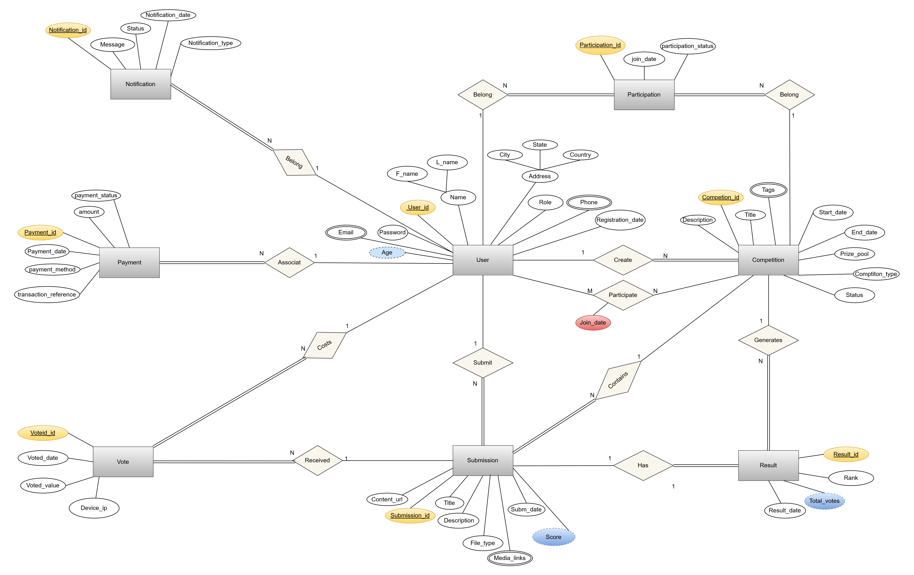
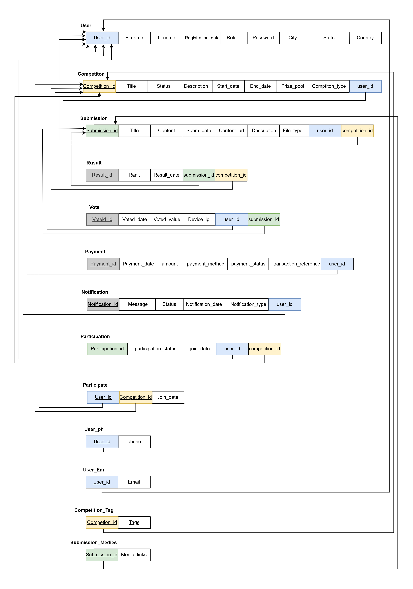

# 🏆 Online Competition & Voting Platform Database

An enterprise-grade **Microsoft SQL Server** relational database built from scratch to power an online competition & voting platform. It manages contestant submissions, voting integrity, real-time score analytics, results, and payments.

> **Tech Stack:** Microsoft SQL Server | T-SQL

---

## 📌 Overview

This project demonstrates a full database lifecycle: **design → implementation → advanced querying**. It models a platform where users register, join competitions, submit entries, get scored by judges, receive votes from the community, and view final rankings — all enforced through normalized tables and integrity constraints.

---

## 📊 Database Design (ERD & Mapping)

### Entity-Relationship Diagram



### Entity Relationship Mapping



---

## 🗃️ Database Schema (15 Tables)

### 👤 Users & Contact Data
| Table | Purpose |
|-------|---------|
| `User` | Registered users (participants & judges) with profile & location data |
| `User_ph` | Multi-value phone numbers per user (composite PK) |
| `User_Em` | Multi-value emails per user with `UNIQUE` / format check |

### 🏅 Competitions
| Table | Purpose |
|-------|---------|
| `Competition` | Competition details, status, timeline & prize pool |
| `Competition_Tag` | Multi-value tags per competition |
| `Participate` | Link table between users and competitions |
| `Participation` | Detailed participation record with status tracking |

### 📄 Submissions
| Table | Purpose |
|-------|---------|
| `Submission` | Contestant entries with content, URL, file type & score |
| `Submission_Medies` | Multi-value media links per submission |

### 🏆 Results & Voting
| Table | Purpose |
|-------|---------|
| `Result` | Final ranks per submission per competition |
| `Vote` | Community voting (1–5) with `UNIQUE(User_id, Submission_id)` to prevent duplicate votes |

### 💳 Payments & Notifications
| Table | Purpose |
|-------|---------|
| `Payment` | Payments with amount check & unique transaction reference |
| `Notification` | In-app notifications with type & read status |

---

## ⚙️ Key Design Features

- **Normalized schema** with proper **PK / FK relationships** across all entities.
- **Integrity constraints:**
  - `CHECK (End_date > Start_date)` — valid competition timeline
  - `CHECK ([Rank] > 0)` — ranks can't be zero/negative
  - `CHECK (Voted_value BETWEEN 1 AND 5)` — valid vote range
  - `CHECK (Amount > 0)` — no negative payments
  - `CHECK (Email LIKE '%@%.%')` — email format validation
  - Multi-valued attributes modeled as separate child tables (phones, emails, tags, media).
- **Sample Data:** ~10 tables populated with realistic demo rows.

---

## 🔬 Advanced SQL Showcase

The script includes a rich set of T-SQL operations:

### DML (Data Manipulation)
- `INSERT` bulk inserts across all tables
- `UPDATE` — conditional scoring (`Score * 1.05`), default fills for `NULL`
- `DELETE` with `IN (subquery)` for cascading cleanup of invalid rows

### Data Retrieval & Filtering
- `SELECT ... WHERE ... ORDER BY`
- `LIKE` wildcard patterns (`'C%'`, `'_h%'`, `'%a%'`)
- `DISTINCT` for unique values

### Aggregate Functions & Grouping
- `COUNT`, `SUM`, `AVG`, `MIN`, `MAX`
- `GROUP BY` + `HAVING` for grouped filtering

### Subqueries & Set Operations
- Scalar subquery (`Score > (SELECT AVG(Score) FROM Submission)`)
- `NOT IN` subquery patterns
- `EXISTS` correlated subqueries
- `UNION`, `UNION ALL`, `INTERSECT`, `EXCEPT`

### Joins
- `INNER JOIN`, `LEFT JOIN`, `RIGHT JOIN` with table aliases

---

## 🚀 Getting Started

### Prerequisites
- **Microsoft SQL Server** (2016+) or SQL Server Express
- **SQL Server Management Studio (SSMS)** — optional for GUI

### Setup
1. Open `SQLQuery3.sql` in SSMS.
2. Run the script against your server. It will:
   - Create all 15 tables
   - Insert sample data
   - Execute demo queries (selects, aggregations, joins, subqueries)

```sql
-- Run the whole script, or run section by section.
```

## 📁 Project Structure

```
competition-voting-db/
├── SQLQuery3.sql      # Full schema + data + advanced queries
├── Erd.png            # Entity-Relationship Diagram image
├── _mapping.png       # Relationship mapping image
└── README.md          # Project documentation
```

---

## 📜 Certifications Reference
Built as part of hands-on training including:
- **Implementing and Developing SQL Server Objects** — *Mahara-Tech / ITI*
- **Digital Egypt Pioneers Initiative (DEPI)** — Data Analytics Track

---

## 📬 Connect

- **Author:** Mohamed Hany
- **LinkedIn:** [Mohamed Hany Abdelfattah](https://www.linkedin.com/in/mohamed-hany-abdelfattah)
- **GitHub:** [Mohamed-Hany-Abdelfattah](https://github.com/Mohamed-Hany-Abdelfattah)
- **Email:** mhmdhanybdalftah045@gmail.com
